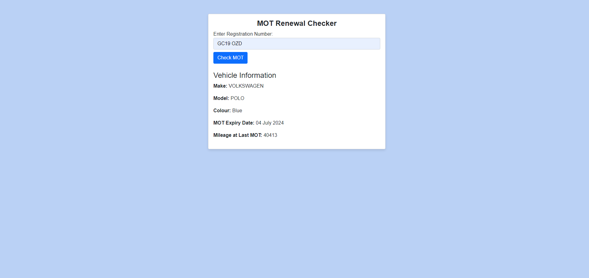

# Blazor MOT Renewal App

A Blazor application to check vehicle MOT details, including expiry date, make, model, and mileage at the last MOT.



## Project Overview

This project allows users to enter a vehicle registration number and retrieve MOT details from a government API.

## Setup Instructions

1. Clone the repository:
    ```sh
    git clone https://github.com/haopengli/blazor-mot-renewal-app.git
    ```
2. Navigate to the project directory:
    ```sh
    cd blazor-mot-renewal-app
    ```
3. Restore dependencies:
    ```sh
    dotnet restore
    ```

## Running the Application

1. Build the project:
    ```sh
    dotnet build
    ```
2. Run the application:
    ```sh
    dotnet run
    ```

## Running Tests

1. Navigate to the test project directory:
    ```sh
    cd MOTRenewalApp.Tests
    ```
2. Run the tests:
    ```sh
    dotnet test
    ```

## Technologies Used

- Blazor
- .NET 6
- Bootstrap
- xUnit
- Moq

## Developer Note

Thank you for reviewing my test submission.

I encourage you to explore the commit history to understand my development process.

The UI is intentionally minimalistic, utilizing Bootstrap for a clean and straightforward design.
